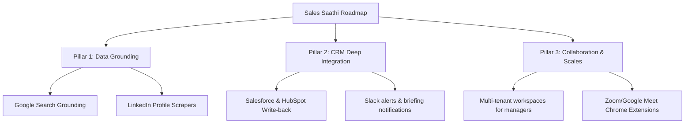

# Sales Saathi — Competitor Analysis & Strategic Roadmap

This document outlines the competitive positioning of Sales Saathi in the sales intelligence market and addresses key strategic questions regarding feature decisions, future roadmap plans, and technical backend architecture.

---

## 1. Competitor Analysis Matrix

Sales Saathi competes with both direct meeting assistants and indirect sales data enrichment tools. The matrix below contrasts Sales Saathi against major direct and indirect solutions.

| Feature / capability | Sales Saathi (Our App) | Direct: Jump AI | Direct: Avoma | Direct: Otter.ai | Indirect: Apollo.io | Indirect: Salesforce Einstein |
| :--- | :--- | :--- | :--- | :--- | :--- | :--- |
| **Primary Value Focus** | Pre-meeting intelligence & Objection playbooks | Transcription & CRM summaries | Meeting assistant & Conversational intelligence | General transcriptions & Note-taking | Prospect data & Email lists | CRM database-driven AI predictions |
| **No-Bot Pre-Meeting Preparation** | **Yes** (Automated via background calendar/news scan) | No (Requires recording meeting first) | No (Requires meeting bot to join call) | No (Requires audio capture) | No (Requires manual lookups) | No (Requires heavy manual setup) |
| **Personalized Ice-Breakers** | **Yes** (Tailored to prospect profile) | No | No | No | No | No |
| **Objection-Handling Playbook**| **Yes** (Dynamic responses tailored to prospect company) | No | No | No | No | No |
| **Google Calendar OAuth Sync** | **Yes** (Automated scheduling) | Yes | Yes | Yes | No | Yes (via Einstein Activity Capture) |
| **Email Brief Delivery** | **Yes** (Polished HTML briefs via Resend) | No | No | No | No | No |
| **CRM Integrations** | Planned (Salesforce, HubSpot) | Yes | Yes | Yes | Yes | Native |
| **Setup Time** | **< 60 seconds** | 5 mins | 5 mins | 3 mins | 10 mins | Weeks/Months |

### Key Competitive Advantages:
1. **Zero-Friction Preparation**: Unlike Avoma or Otter.ai, Sales Saathi does *not* force a bot to join the meeting room. Many executives find meeting-bots intrusive; Sales Saathi operates silently in the background, preparing the rep *before* the meeting begins.
2. **Context-Specific objection playbooks**: Rather than just transcription or general contact data, Sales Saathi provides actionable sales strategies (dynamic conversation starters, objection playbooks, BANT markers).
3. **Product-Led Growth (PLG) Velocity**: With a 60-second setup, single sign-on, and automated calendar link, the Time-to-Value (TTV) is significantly lower than enterprise sales intelligence systems.

---

## 2. Feature Scoping: Why ONLY these MVP features? (Evaluator Q1)

> [!NOTE]
> *“Why did you decide to go with only these features for the MVP?”*

The scoping decisions for Sales Saathi were guided by the **MoSCoW Prioritization framework** and focused on the following strategic factors:

1. **Maximized Focus on Core Value Proposition**: The ultimate goal of Sales Saathi is to save time spent on pre-call research and increase closing confidence. The MVP addresses the critical path:
   * **Identify meeting** (Calendar sync) → **Gather intelligence** (Gemini Brief generation) → **Consume brief** (Dashboard & Email delivery).
   Adding minor features would have diluted our engineering focus on the quality of the AI briefs.
2. **Elimination of Setup Friction**: Sales representatives are notoriously resistant to heavy administrative software. By scoping the MVP to Google Sign-In and Google Calendar OAuth, we achieved a **"one-click onboarding"** experience.
3. **Resource & Velocity Constraints**: As a Phase 5 submission, building a massive suite of features (e.g., custom dialers or pipeline prediction dashboards) would lead to a buggy and unpolished product. We prioritized visual excellence, dark-mode aesthetics, and solid database persistence.
4. **MoSCoW Rationale**:
   * **Must Haves**: Secure authentication (Supabase Auth), AI briefs (Gemini), persistence (Supabase Postgres), and responsive client UI.
   * **Should Haves**: Google Calendar connection, Resend email delivery.
   * **Could Haves**: Bidirectional CRM write-back, automated prospect enrichment APIs (moved to future plans).

---

## 3. Product Roadmap & Future Plans (Evaluator Q2)

> [!TIP]
> *“What are the future plans and next phases for Sales Saathi?”*

We have structured the next iterations of the product into three core pillars:



### Pillar 1: Real-Time Grounding & Scraping (Data Quality)
* **Search Grounding**: Integrate Google Search Grounding with Gemini 2.5 Flash. This will allow the AI agent to pull live news (e.g., funding announcements, executive shifts) from the morning of the meeting, rather than relying solely on pre-trained web knowledge.
* **Social Data Harvesting**: Integrate secure scraper APIs (such as Proxycurl) to pull live LinkedIn updates and posts from the prospect, enabling highly hyper-personalized ice-breakers.

### Pillar 2: Deep CRM & Workflow Integrations (Workflow Fit)
* **Bidirectional CRM Sync**: Automatically write back generated briefs, meeting notes, and deal objections directly into the opportunity timeline inside **HubSpot** and **Salesforce**.
* **Slack Bot**: Deliver pre-meeting briefs directly to a sales rep's Slack DMs 15 minutes before the meeting starts, complete with quick action buttons to email or edit the notes.

### Pillar 3: Collaboration & Enterprise Scale (Growth & Monetization)
* **Team Workspaces**: Allow sales leaders to view team analytics (average preparation rates, hours saved) and share custom objection-handling playbooks across all reps.
* **Browser Overlay (Chrome Extension)**: Surface Sales Saathi briefs as a sidebar overlay directly inside Zoom, Google Meet, or Microsoft Teams during the live call.

---

## 4. Backend Integrations & Overall Architecture (Evaluator Q3)

> [!IMPORTANT]
> *“How were the backend integrations made? What is the overall working of the app?”*

Sales Saathi uses a modern serverless architecture combining a static Multi-Page Application (MPA) frontend with a Supabase BaaS (Backend-as-a-Service) and Google Gemini AI.

### Architectural Diagram
```
  [ Frontend Client (Vite + Alpine.js) ]
               │             │
        REST / OAuth    Auth & DB Writes (RLS Enforced)
               │             │
               ▼             ▼
       [ Supabase Edge Functions ] ─── Deno (postgresjs) ───► [ Postgres DB ]
               │
      HTTP Rest API Calls
               │
               ├─► [ Google Gemini API ] (Gemini 2.5 Flash with JSON Schema)
               ├─► [ Google Calendar API ] (OAuth meeting sync)
               └─► [ Resend API ] (HTML Email brief delivery)
```

### Overall Working of the App
1. **User Auth**: When a rep signs up or logs in (`auth.html` → [auth.js](file:///d:/Courses/Bitsom/Project/Phase%205/Versions/Presentation%20final/sales-saathi_demo-ready_v0.4.0/src/auth.js)), they authenticate with **Supabase Auth** (Email, Magic Link, or Google OAuth). The browser stores the user's JWT.
2. **Google Calendar Linking**: In the dashboard settings (`settings.html`), the user links their Google account. The token is sent to the backend and securely saved in a private database schema (`private.google_tokens`) which is hidden from public API keys.
3. **Unified Calendar Sync**: 
   * When the user loads the dashboard (`dashboard.html`), a call is dispatched to the `/sync-google-calendar` edge function.
   * This Deno edge function queries `private.google_tokens` using a direct Postgres connection.
   * If the token is expired, it requests a new access token from Google's token endpoint using stored environment secrets.
   * It calls the Google Calendar API, fetches events for the next 30 days, and upserts them into the `UnifiedMeetings` table under the user's ID.
4. **AI Brief Generation**:
   * When a user clicks "Generate Brief", the client invokes the `/generate-brief` edge function, passing the prospect's details and the user's JWT.
   * The edge function validates the user's identity, retrieves Deno environment variables (`GEMINI_API_KEY`), and formats the prompt.
   * It issues an HTTP request to the Google Gemini 2.5 Flash endpoint, passing a strict JSON response schema.
   * Gemini returns a pre-formatted JSON payload containing the 13 brief sections.
   * The edge function saves the brief in the `PreMeetingBriefs` table and updates the meeting link. Row-Level Security (RLS) ensures that reps can never read or write another rep's briefs.
5. **Email Delivery**: When the user requests an email copy, the `/send-brief-email` function is triggered. It fetches the brief details, formats a mobile-friendly HTML template, and invokes the **Resend API** to email it directly to the user.

---

### Technical Documents Reference:
For a detailed review of code implementations and database layouts:
* Frontend Bundle Configuration: [FRONTEND.md](file:///d:/Courses/Bitsom/Project/Phase%205/Versions/Presentation%20final/sales-saathi_demo-ready_v0.4.0/docs/architecture/FRONTEND.md)
* Supabase Edge Functions: [EDGE_FUNCTIONS.md](file:///d:/Courses/Bitsom/Project/Phase%205/Versions/Presentation%20final/sales-saathi_demo-ready_v0.4.0/docs/architecture/EDGE_FUNCTIONS.md)
* Gemini Prompt & Schema: [GEMINI_INTEGRATION.md](file:///d:/Courses/Bitsom/Project/Phase%205/Versions/Presentation%20final/sales-saathi_demo-ready_v0.4.0/docs/architecture/GEMINI_INTEGRATION.md)
* Postgres Schema & RLS: [DATABASE_SCHEMA.md](file:///d:/Courses/Bitsom/Project/Phase%205/Versions/Presentation%20final/sales-saathi_demo-ready_v0.4.0/docs/architecture/DATABASE_SCHEMA.md)
